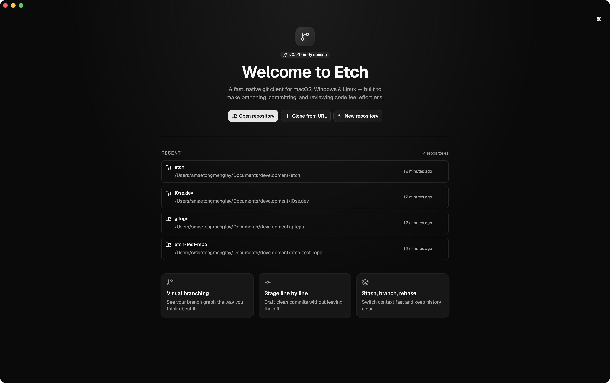
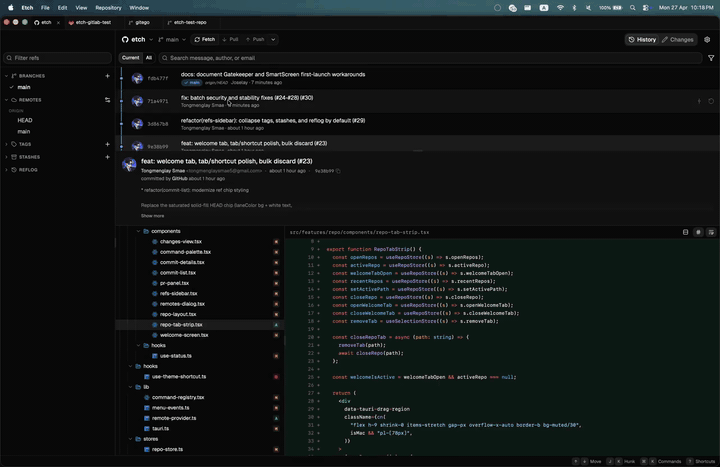
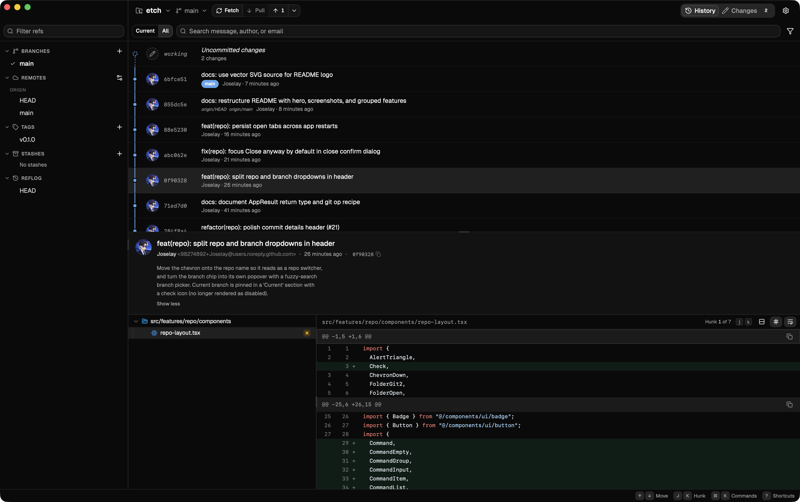
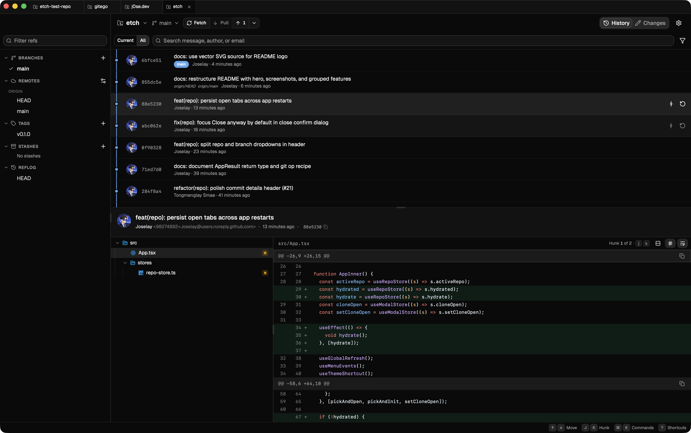
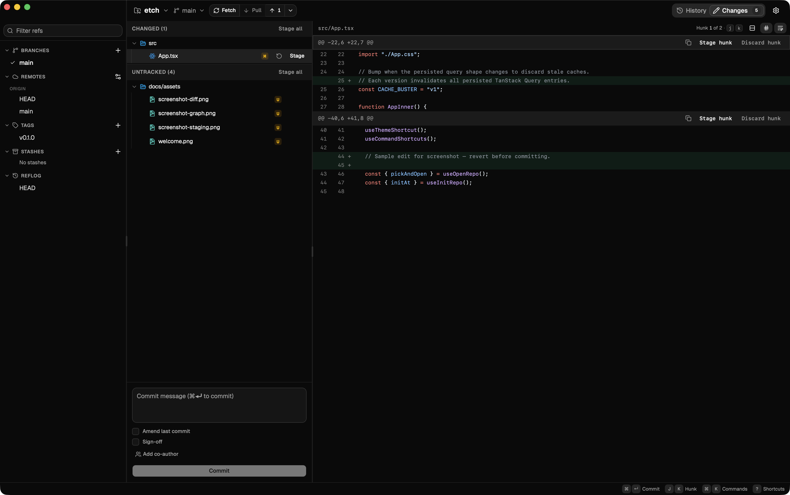

<div align="center">
  

  <h1>Etch</h1>

  <p><strong>A fast, native Git GUI for macOS, Windows & Linux.</strong><br/>
  Built to make branching, committing, and reviewing code feel effortless.</p>

  <p>
    <a href="./LICENSE"></a>
    <a href="https://github.com/Joselay/etch/releases"></a>
    
    
  </p>

  
</div>

> ⚠️ **Pre-1.0 alpha.** Etch is built and maintained by a single developer. It works for everyday local development, but you _will_ find bugs in less common workflows. Please use it on repositories you can recover (or that are already pushed to a remote), and [open an issue](https://github.com/Joselay/etch/issues/new/choose) when something breaks — that's the fastest way the project improves.

<div align="center">
  
</div>

## Why Etch?

- **Native and fast.** Built on Tauri 2 — small binary, low memory, no Electron.
- **Multi-repo tabs.** Switch between repositories the way you switch browser tabs. Sessions persist across restarts.
- **Keyboard-first.** Navigate the graph, stage hunks, and run any command without leaving the home row. `⌘K` opens the palette.
- **Honest visuals.** Strict neutral palette, word-level diffs, readable commit graph — designed to disappear when you're working.
- **Open source.** MIT-licensed, no telemetry, no account required.

## Screenshots

| | |
|---|---|
|  |  |
| **Commit graph & history** | **Word-level diff viewer** |
|  |  |
| **Line-by-line staging** | **Command palette (`⌘K`)** |

## Features

**Browse & inspect**
- Commit history with a readable lane-colored graph
- Word-level diffs with syntax highlighting
- Blame, bisect, and reflog views
- Inspect merge conflicts and resolve common conflict states

**Stage & commit**
- Stage, unstage, discard, and patch-apply by line or hunk
- Signed commits via GPG/SSH (where configured)
- Amend, fixup, and reword from the history view

**Branch & sync**
- Create, rename, checkout, delete, and track branches
- Tags, stashes, and worktrees
- Fetch, pull, push, and manage remotes
- GitHub provider tokens stored in the native OS keychain

**Advanced**
- Interactive rebase (reorder, squash, drop)
- Submodule inspection and common updates
- Multi-repository tabs that persist across app restarts

## Install

Pre-built binaries for macOS, Windows, and Linux are published on the [Releases page](https://github.com/Joselay/etch/releases).

> Release builds are not yet code-signed/notarized. Expect a Gatekeeper / SmartScreen warning on first launch.

To build from source, see [Development](#development).

## Known limitations

These are areas that are intentionally minimal or untested in v0.1. Reports and PRs welcome:

- **Large repositories** — performance on repos with very large histories (>100k commits) or huge working trees has not been broadly tested.
- **Git LFS** — basic operations work; less common LFS flows (locks, custom transfer agents) are not exercised.
- **Submodules** — supported for inspection and common updates; deeply nested or recursive submodule edits may be rough.
- **Interactive rebase** — works for common reorder/squash/drop flows; exotic todo edits and conflicts mid-rebase may need terminal fallback.
- **Signed commits / SSH signing** — basic GPG/SSH signing is wired through `git`; advanced key configurations may not surface helpful errors.
- **Windows path edge cases** — long paths, case-insensitive collisions, and CRLF behaviors are less tested than macOS/Linux.
- **Monorepos with sparse checkout / partial clone** — not specifically optimized.
- **No built-in merge conflict editor** — Etch surfaces conflicts and lets you resolve files; complex three-way merging is best done in your editor.
- **Code signing** — current release builds are not yet code-signed/notarized on macOS or Windows.

## Development

Requires [Bun](https://bun.sh), [Rust](https://rustup.rs), and the [Tauri prerequisites](https://tauri.app/start/prerequisites/) for your OS.

```bash
bun install
bun run tauri dev
```

For UI-only iteration without the Tauri shell:

```bash
bun run dev
```

Before opening a pull request, run:

```bash
bun run typecheck
bun run lint
bun run test:run
cd src-tauri && cargo fmt --all --check && cargo clippy --all-targets --all-features -- -D warnings
```

A full list of scripts and contributor workflow lives in [CONTRIBUTING.md](./CONTRIBUTING.md).

## Contributing

Please read [CONTRIBUTING.md](./CONTRIBUTING.md) before opening a pull request. Use the GitHub issue templates for bugs and feature requests. For security vulnerabilities, follow [SECURITY.md](./SECURITY.md) instead of opening a public issue.

All participants are expected to follow the [Code of Conduct](./CODE_OF_CONDUCT.md).

## Tech stack

- **Runtime:** Tauri 2 (Rust core) + Vite + React 19 + TypeScript
- **UI:** Tailwind CSS v4, shadcn/ui, Base UI, Radix, lucide icons
- **Tooling:** Bun, Biome (lint/format), Vitest

## Project status

Etch is open source under the MIT License and accepts contributions through GitHub issues and pull requests.

- Public API and UI workflows can change before 1.0.
- Only the `main` branch receives security fixes.
- Release builds are produced from `v*` tags through GitHub Actions.
- Release notes are tracked in [CHANGELOG.md](./CHANGELOG.md).

## License

[MIT](./LICENSE) — built by [@Joselay](https://github.com/Joselay). If Etch is useful to you, [star the repo](https://github.com/Joselay/etch) — it genuinely helps.
