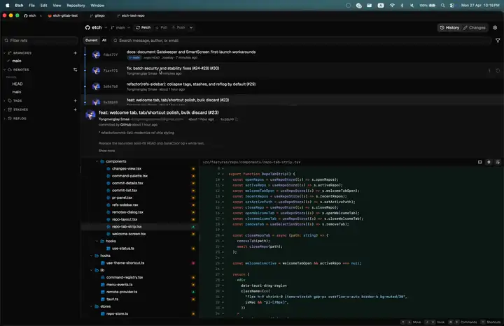

<div align="center">
  

  <h1>Etch</h1>

  <p><strong>A fast Git GUI for macOS, Windows & Linux.</strong></p>

  
</div>

> Personal project — built for my own use. Source is public under MIT, but I'm not accepting issues, PRs, or feature requests.

## Features

- Lane-colored commit graph, word-level diffs with syntax highlighting, blame, bisect, reflog, conflict inspection.
- Line- and hunk-level staging, GPG/SSH signed commits, amend / fixup / reword from the history view.
- Branches, tags, stashes, worktrees, remotes; GitHub tokens stored in the native OS keychain.
- Interactive rebase (reorder / squash / drop), multi-repo tabs that persist across restarts.
- `⌘K` command palette.

## Build from source

Requires [Bun](https://bun.sh), [Rust](https://rustup.rs), and the [Tauri prerequisites](https://tauri.app/start/prerequisites/) for your OS.

```bash
bun install
bun run tauri build
```

Installer artifacts land in `src-tauri/target/release/bundle/`.

For development:

```bash
bun run tauri dev
```

### First-launch warning (unsigned builds)

Builds are not code-signed/notarized.

**macOS** — if it refuses to open with _"Etch.app is damaged"_ or _"developer cannot be verified"_:

```bash
xattr -dr com.apple.quarantine /Applications/Etch.app
```

**Windows** — SmartScreen shows _"Windows protected your PC"_. Click **More info → Run anyway**.

## Tech stack

Tauri 2 (Rust core) + Vite + React 19 + TypeScript. Tailwind v4, shadcn/ui, Base UI, Radix, lucide. Bun, Biome, Vitest.

## Authorship

Built and maintained by [@Joselay](https://github.com/Joselay). Recent commits on `main` are signed with my personal SSH key and show a **Verified** badge on GitHub.

If you fork or copy this code, [MIT](./LICENSE) requires you to keep the copyright notice. Please don't strip it and republish as your own original work.

## License

[MIT](./LICENSE) — Copyright (c) 2026 Joselay.
